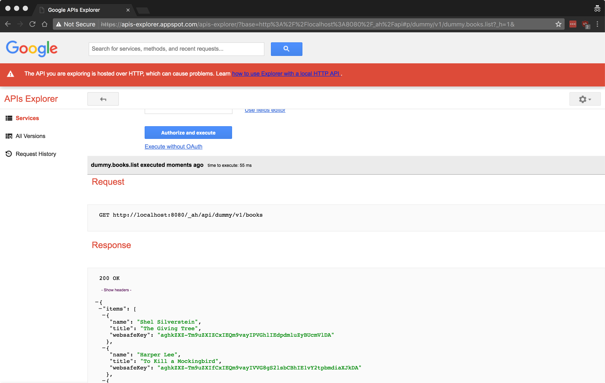

# endpoint api (python)

this is demo project for [weddingcnp via GCP - 3. endpointAPI 設計實作]()



```sh
# git clone repo
$ git clone git@github.com:cage1016/endpoint-api-demo.git

# install GAE python requirement packages
$ pip install -r requirements.txt -t lib
Collecting arrow==0.8.0 (from -r requirements.txt (line 1))
Collecting python-dateutil (from arrow==0.8.0->-r requirements.txt (line 1))
  Downloading python_dateutil-2.6.1-py2.py3-none-any.whl (194kB)
    100% |████████████████████████████████| 194kB 1.2MB/s
Collecting six>=1.5 (from python-dateutil->arrow==0.8.0->-r requirements.txt (line 1))
  Using cached six-1.10.0-py2.py3-none-any.whl
Installing collected packages: six, python-dateutil, arrow
Successfully installed arrow python-dateutil-2.2 six-1.10.0
...

# run GAE python locally
$ dev_appserver.py app.yaml
INFO     2017-07-12 13:30:19,063 devappserver2.py:116] Skipping SDK update check.
INFO     2017-07-12 13:30:19,706 api_server.py:312] Starting API server at: http://localhost:51100
INFO     2017-07-12 13:30:19,710 dispatcher.py:226] Starting module "default" running at: http://localhost:8080
INFO     2017-07-12 13:30:19,711 admin_server.py:116] Starting admin server at: http://localhost:8000

# visit http://localhost:8080
```
